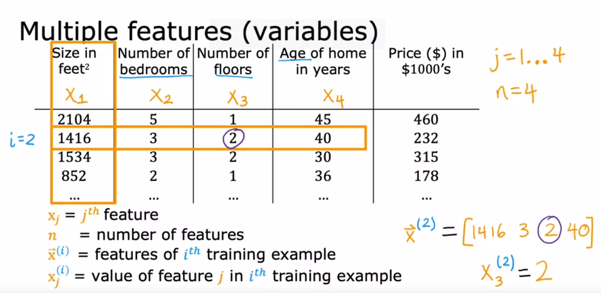
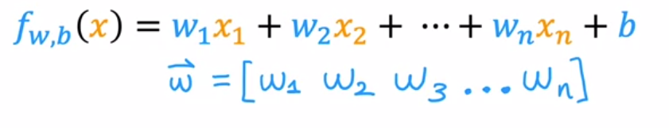
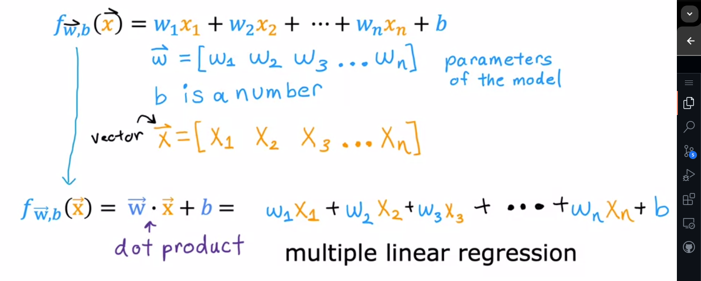
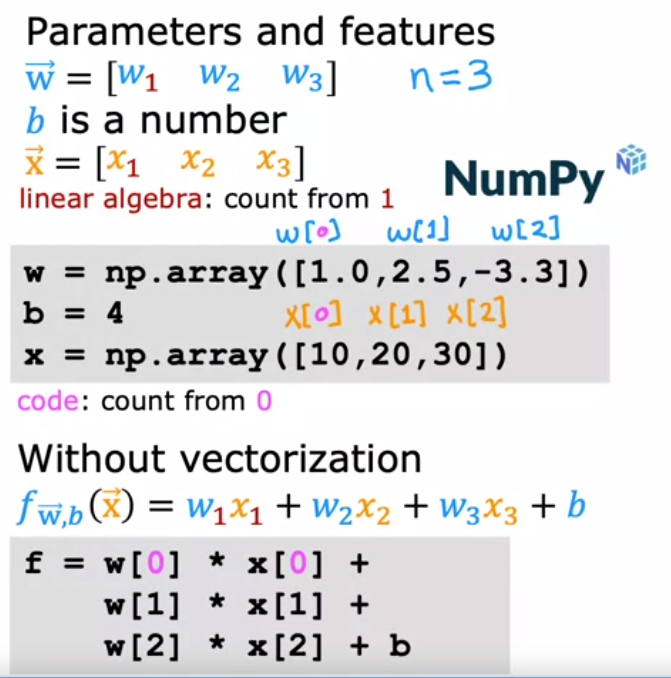
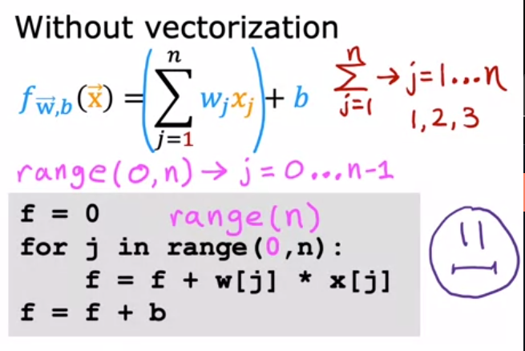
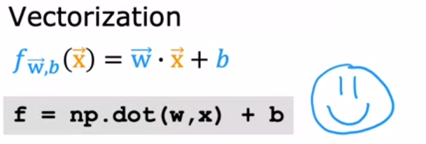

<a style="color:Orange;" ><h1 style="color:Orange;">
    Week 2: Regression with multiple input variables
</h1></a>  

## 0. Multiple Features
- Now we are estimating many things from the same set of input
- More variables


- For n features the model will look like this :
  
### Using vectors to represent variables and parameters :


---


## 1. Vectorization part 1






## Using vectorization , the calculation is much faster:



```python
f = np.dot(w,x)+b
```


## 2. Vectorization part 2

### - Vectorization uses computesr specialised hardware to multiple and add very quickly. It uses parallel processing hardware.
### - Gradient Descent using vectorization :
(image-24.png)

## 3. Ungraded Lab 1: Optional lab: Python, NumPy and vectorization

### [Open lab Jupyter Notebook](https://github.com/vinitkesh/Machine-Learnin-Specialisation-by-Andrew-NG/blob/main/Labs/C1%20-%20Supervised%20Machine%20Learning%20-%20Regression%20and%20Classification/week2/Optional%20Labs/C1_W2_Lab01_Python_Numpy_Vectorization_Soln.ipynb)


## 4. Gradient descent for multiple linear regression
## 5. Ungraded Lab 2: Optional Lab: Multiple linear regression
## 6. Feature scaling part 1
## 7. Feature scaling part 2
## 8. Checking gradient descent for convergence
## 9. Choosing the learning rate
## 10. Ungraded Lab 3: Optional Lab: Feature scaling and learning rate
## 11. Feature engineering
## 12. Polynomial regression
## 13. Ungraded Lab 4 : Optional lab: Feature engineering and Polynomial regression
## 14. Ungraded Lab 5: Optional lab: Linear regression with scikit-learn

---