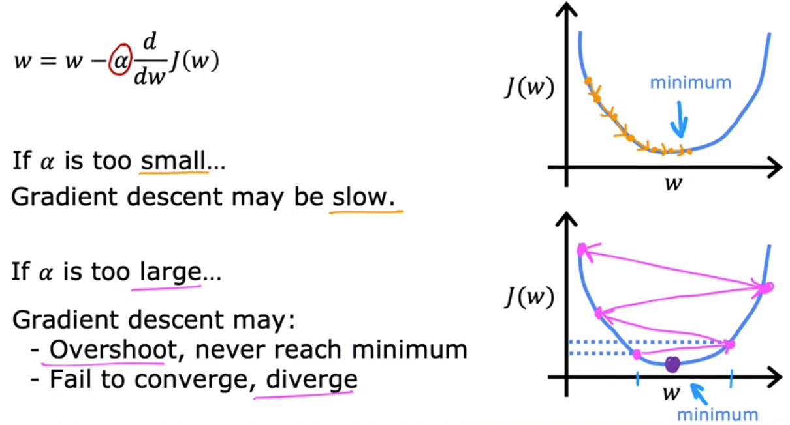
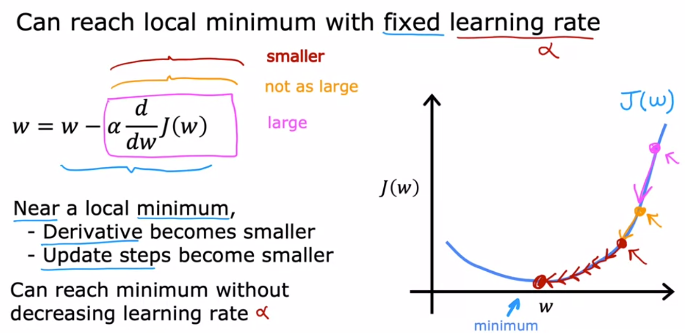
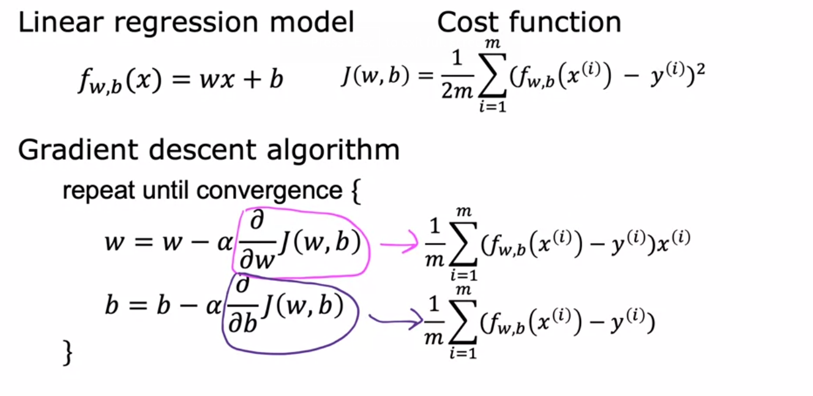
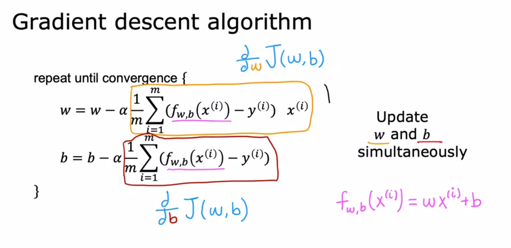

# Supervised Machine Learning: Regression and Classification
--  by DeepLearning.AI & Stanford University

### [Week 1:]() Intro to Machine Learning 
### [Week 2:]()  Regression with multiple input variables
### [Week 3:]()  Classification
--- 
# [Week 1:]() Intro to Machine Learning 
## 1. Overview of ML
## 2. Sup vs UnSup ML

## Optional lab


- Numpy is an important library that will be used a lot

```
print(f"zzzzz {var}")
```
- Prints a var inside like printf in C
---
## 3. Regression model 

## Cost function notes:
### Cost function


### - When J has 2 parameters w and b i.e. 

$$ J(w,b):$$


## Contour /plots for a given set of data:

## Plotting a particular values of w and b to get a not so fitting line:


## Cost Function Optional lab
### 3D Visualization of 3 contour map to 3d curve : $$curve :(w,b,J(w,b))$$
- Notice the red dot's position wrt to the position of its corresponding point in the contour plot
$$Cost=166008;(very-high)$$  

  

$$Cost=1738; (lower)$$  


## Gradient Descent:
### An algorithm to minimise any function (also our cost function!)


## Implementing Gradient descent algorithm:
  


## Intuition of Gradient Descent Algo:

  

### - Uproaching from left or right, we are always moving towards the minima.

## Learning rate


### As we upproach gradient descent, the updatiion automatically takes small steps:


## Gradient Descent for Linear regression model




> ### ISSUE: Ending up in local instead of GLobal minima  
> ### Soln: A squared error cost function is convex and will only have global minima(bowl shaped)

## F


---
---
<h1 style="color:Orange;">Week 2: Regression with multiple input variables</h1>  


## 1. Vectorization part 1
## 2. Vectorization part 2
## 3. Ungraded Lab: Optional lab: Python, NumPy and vectorization
## 4. Gradient descent for multiple linear regression
## 5. Ungraded Lab: Optional Lab: Multiple linear regression
## 6. Feature scaling part 1
## 7. Feature scaling part 2
## 8. Checking gradient descent for convergence
## 9. Choosing the learning rate
## 10. Ungraded Lab: Optional Lab: Feature scaling and learning rate
## 11. Feature engineering
## 12. Polynomial regression
## 13. Ungraded Lab: Optional lab: Feature engineering and Polynomial regression
## 14. Ungraded Lab: Optional lab: Linear regression with scikit-learn


---
 <h1 style="color:Orange;">Week 3: Classification</h1> 

## 1. Ungraded Lab: Optional lab: Classification
## 2. Video: Logistic regression
## 3. Ungraded Lab: Optional lab: Sigmoid function and logistic regression
## 4. Video: Decision boundary
## 5. Ungraded Lab: Optional lab: Decision boundary
## 6. Video: Cost function for logistic regression
## 7. Ungraded Lab: Optional lab: Logistic loss
## 8. Video: Simplified Cost Function for Logistic Regression
## 9. Ungraded Lab: Optional lab: Cost function for logistic regression
## 10. Video: Gradient Descent Implementation
## 11. Ungraded Lab: Optional lab: Gradient descent for logistic regression
## 12. Ungraded Lab: Optional lab: Logistic regression with scikit-learn
## 13. Video: The problem of overfitting
## 14. Video: Addressing overfitting
## 15. Ungraded Lab: Optional lab: Overfitting
## 16. Video: Cost function with regularization
## 17. Video: Regularized linear regression
## 18. Video: Regularized logistic regression
## 19. Ungraded Lab: Optional lab: Regularization
## 20. Reading: [IMPORTANT] Reminder about end of access to Lab Notebooks
## 21. Video: Andrew Ng and Fei-Fei Li on Human-Centered AI