# Supervised Machine Learning: Regression and Classification
--  by DeepLearning.AI & Stanford University

### [Week 1:]() Intro to Machine Learning 
### [Week 2:]()  Regression with multiple input variables
### [Week 3:]()  Classification
--- 
# [Week 1:]() Intro to Machine Learning 
## 1. Overview of ML
## 2. Sup vs UnSup ML

## Optional lab


- Numpy is an important library that will be used a lot

```
print(f"zzzzz {var}")
```
- Prints a var inside like printf in C
---
## 3. Regression model 
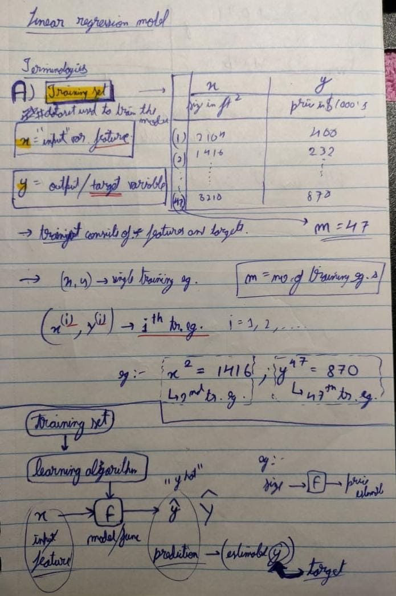
## Cost function notes:
### Cost function
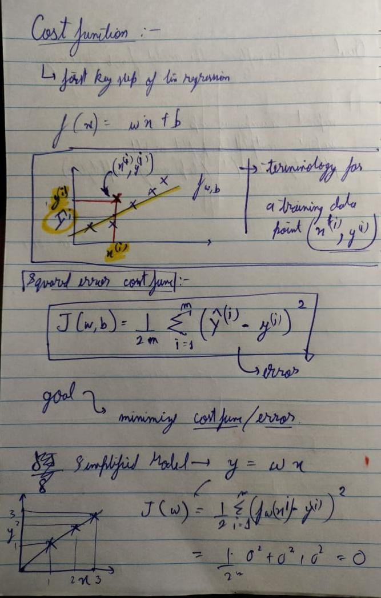

### - When J has 2 parameters w and b i.e. 

$$ J(w,b):$$

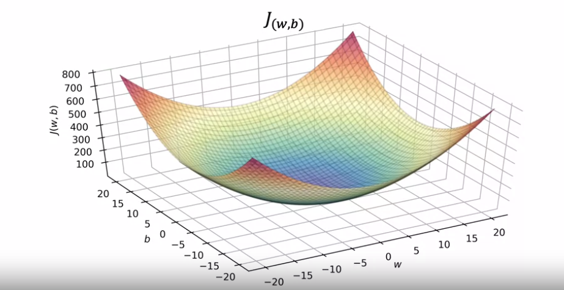
## Contour /plots for a given set of data:
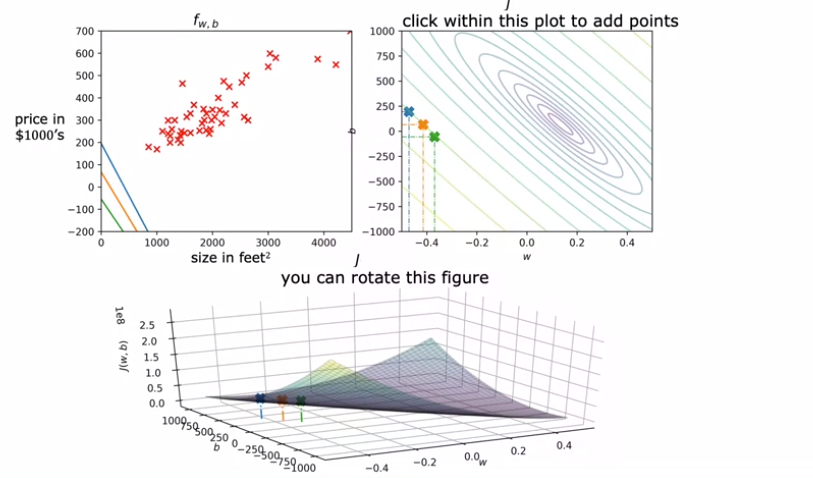
## Plotting a particular values of w and b to get a not so fitting line:
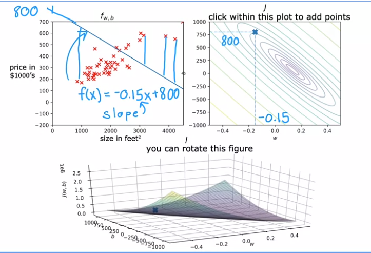

## Cost Function Optional lab
### 3D Visualization of 3 contour map to 3d curve : $$curve :(w,b,J(w,b))$$
- Notice the red dot's position wrt to the position of its corresponding point in the contour plot
$$Cost=166008;(very-high)$$  
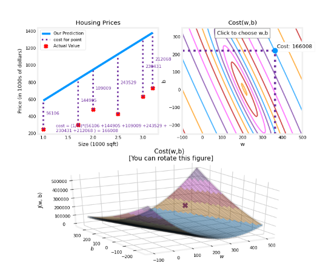
$$Cost=1738; (lower)$$  
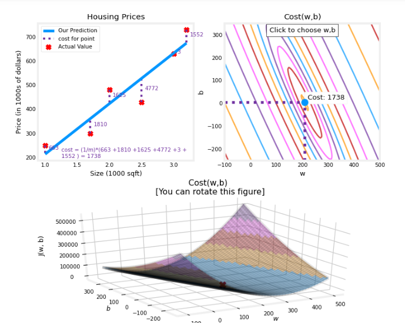

## Gradient Descent:
### An algorithm to minimise any function (also our cost function!)

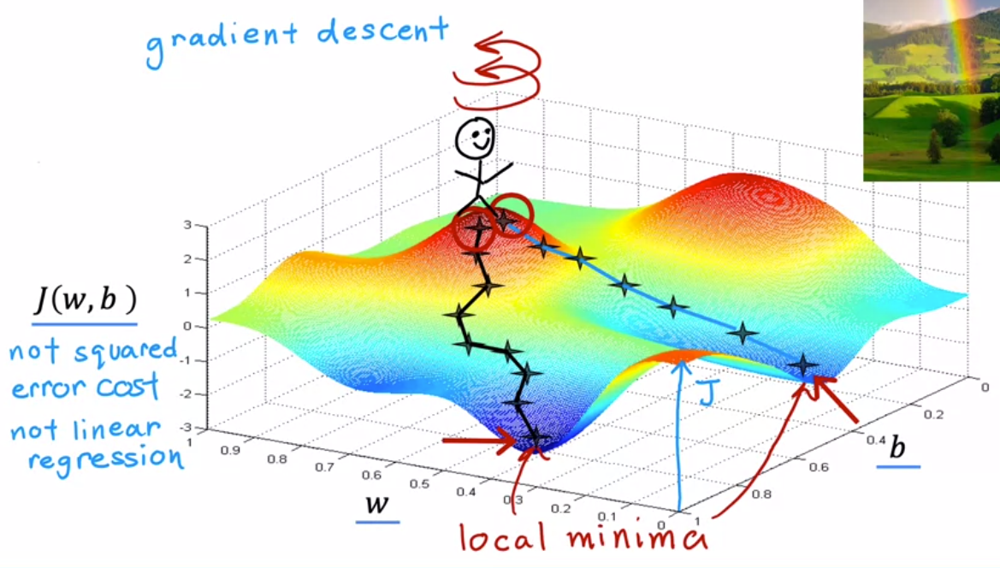


## Implementing Gradient descent algorithm:
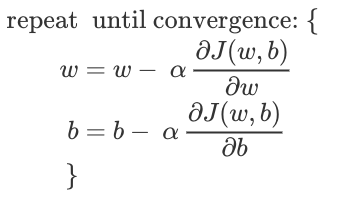  
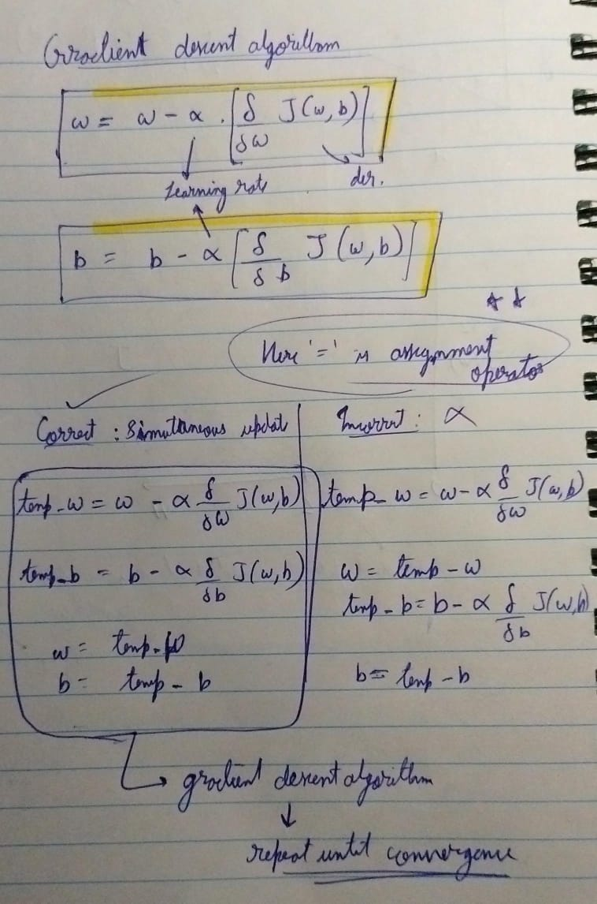

## Intuition of Gradient Descent Algo:

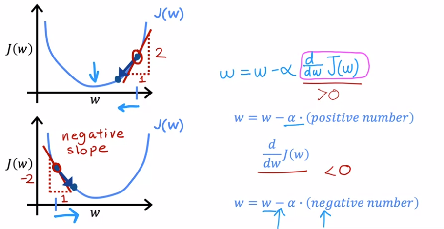  

### - Uproaching from left or right, we are always moving towards the minima.
---
## [Week 2:]()  Regression with multiple input variables
### Multiple Lin regression
### Gradient descent in practise
### Training with gradient descent
### Gradient descent practice lab
---
## [Week 3:]()  Classification
## Classification with logistic regression
## Cost function of logistic regression
## Gradient Descent for logistic regression
## Problem of overfitting
## Practice lab : logistic regression
